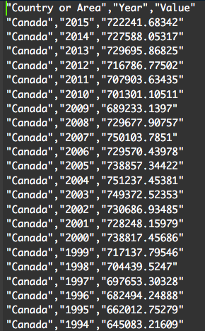

# Greenhouse Emission Comparisons

Contributers:
- [Miliban Keyim](https://github.com/mkeyim)
- [Chao Wang](https://github.com/chaomander2018)
- [Kera Yucel](https://github.com/K3ra-y)  

## Overview of contents

This report contains an inferential analysis regarding the Greenhouse Gas Emissions from 10 countriesbetween 1990 and 2015. The analysis aims to find if these is a differences of greenhouse gas emissions (kt)across these countries in the past 25 years. An ANOVA was performed to determine whether there is anysignificant difference in GHG Emissions when observed, multiple comparisons on counties were performed.The data is obtained from the Greenhouse Gas Inventory Data of the United Nations Framework Conventionon Climate Change.

The final report consists:
- Hypothesis
- Statistical Summary of ANOVA
- Interpretation of Findings
- Critics, Limitations, and Assumptions on Analysis
- References

## Data

### Dataset 
- This analysis is performed on [Greenhouse Gas (GHGs) Emissions, including Indirect CO2, without LULUCF, in kilotonne CO2 equivalent](http://data.un.org/Data.aspx?d=GHG&f=seriesID%3aGH2) provided by the United Nations Statistics Division databases.


### Data Attributes
- Country or Area: characters
- Year: numeric
- Value: numeric


### Data snippet
The dataset can be loaded using the Rscript. Below is a screenshot of the dataset loaded in R.



## The Analysis
We performed a set of [data exploration](https://besjournals.onlinelibrary.wiley.com/doi/full/10.1111/j.2041-210X.2009.00001.x) to identify initial problems in the dataset.

- Calculate means and variances for the 10 countries.

- Check outliers

- Plot a line graph to see the general trend of the 10 countries' Green House Gas emssion within the time frame.

- Set up hypotheses and determine level of significance.  
 
  * H0: The expected mean greenhouse gas emmision of all countries are equal.
  * H1: The expected mean greenhouse gas emmision of all countries are not equal.

- *ANOVA* is used to decide whether there is a significant difference in the Greenhouse Gas Emission across the 10 countries.

- We used Tukey multiple pairwise-comparison to define which countries are significantly different than the other one.

- Prepare a table and a boxplot to show differences between counties and report F-value, p-value and means.

- Conclusion.


## Procedure

This project contains five major steps including data cleaning, exploratory data analysis, ANOVA test, data visualization and final report.


## Usage
The usage of the scripts are:
```
# Load data
Rscript scripts/1_load_data.R data/raw/2018-11-14_DSCI_522_project_UN-data_GH.csv data/clean_data_GH.csv

# EDA
Rscript scripts/2_data_exploration.R data/clean_data_GH.csv results/fig/GHG_exploreView.png

# Clean data
Rscript scripts/3_analyze_data.R data/clean_data_GH.csv results/summarized_data.csv

# Create the boxplot
Rscript scripts/4_plot_results.R data/clean_data_GH.csv results/fig/GH_boxplot.png

# Create the estimate the ci
Rscript scripts/5_plot_estimates.R data/clean_data_GH.csv results/fig/GH_est_plot.png


# write the report
Rscript -e "rmarkdown::render('results/report.Rmd')"
```

Or, you can use our run_all.sh in the root repository:
```
bash run_all.sh
```
The report will be rendered into a PDF document.

## Dependencies

R version 3.5.1

library(readr)

library(ggplot2)

library(tidyverse)

library(dplyr)

library(forcats)

library(broom)

library(scales)

library(emmeans)

library(multcompView)

library(multcomp)


## Repository Structure

[doc](https://github.com/UBC-MDS/DSCI_522_greenhouse_emissions_comparisons/tree/master/doc)

  - [report.Rmd](https://github.com/UBC-MDS/DSCI_522_greenhouse_emissions_comparisons/blob/master/doc/report.Rmd)

[data](https://github.com/UBC-MDS/DSCI_522_greenhouse_emissions_comparisons/tree/master/data)
  - [raw](https://github.com/UBC-MDS/DSCI_522_greenhouse_emissions_comparisons/tree/master/data/raw)

[scripts](https://github.com/UBC-MDS/DSCI_522_greenhouse_emissions_comparisons/tree/master/scripts)
  - [load_data.R](https://github.com/UBC-MDS/DSCI_522_greenhouse_emissions_comparisons/blob/master/scripts/1_load_data.R)
  
  - [data_exploration_and_clean_data.R](https://github.com/UBC-MDS/DSCI_522_greenhouse_emissions_comparisons/blob/master/scripts/2_data_exploration.R)

  - [analyze_data.R](https://github.com/UBC-MDS/DSCI_522_greenhouse_emissions_comparisons/blob/master/scripts/3_analyze_data.R)
  
  - [plot_results.R](https://github.com/UBC-MDS/DSCI_522_greenhouse_emissions_comparisons/blob/master/scripts/4_plot_results.R)
  
  - [plot_estimate.R](https://github.com/UBC-MDS/DSCI_522_greenhouse_emissions_comparisons/blob/master/scripts/5_plot_estimates.R)

[results](https://github.com/UBC-MDS/DSCI_522_greenhouse_emissions_comparisons/tree/master/results)

  - [report.pdf](https://github.com/UBC-MDS/DSCI_522_greenhouse_emissions_comparisons/blob/master/results/report.pdf)
  

## Release version
 - [V1.0](https://github.com/UBC-MDS/DSCI_522_greenhouse_emissions_comparisons/releases/tag/v1.0) Proposal
 - [V2.1](https://github.com/UBC-MDS/DSCI_522_greenhouse_emissions_comparisons/releases/tag/V2.1) Milestone 1 
