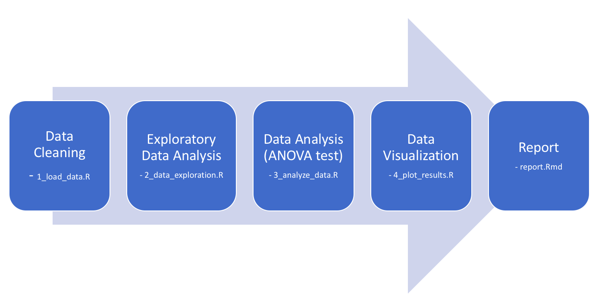
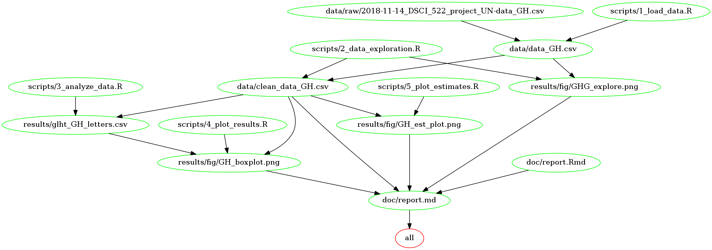

# Greenhouse Emission Comparisons

Contributers:
- [Miliban Keyim](https://github.com/mkeyim)
- [Chao Wang](https://github.com/chaomander2018)
- [Kera Yucel](https://github.com/K3ra-y)  

## Overview of contents

### Question: Is there an overall significant difference among the counties in their greenhouse gas emission?

This report contains an exploratory analysis regarding the Greenhouse Gas Emissions from 10 countries between 1990 and 2015. The data is obtained from the Greenhouse Gas Inventory Data of the United Nations Framework Convention Climate Change. The analysis aims to find if these are differences of greenhouse gas emissions (kt) across these countries. An ANOVA was performed to determine whether there is any significant difference in GHG emissions when observed, multiple comparisons on counties were performed.

Countries included into the analysis: Latvia, Switzerland, Portugal, Finland, Denmark, Czech Republic, Netherlands, Canada, Japan.

The final report consists:
- Hypothesis
- Statistical Summary of ANOVA
- Interpretation of Findings
- Critics, Limitations, and Assumptions on Analysis
- References

## Data

### Dataset
- This analysis is performed on [Greenhouse Gas (GHGs) Emissions, including Indirect CO2, without LULUCF, in kilotonne CO2 equivalent](http://data.un.org/Data.aspx?d=GHG&f=seriesID%3aGH2) provided by the United Nations Statistics Division databases.


### Data Attributes
- Country or Area: characters (set as `factor` for the analysis)
- Year: numeric
- Value: numeric


## The Analysis
We performed a set of [data exploration](https://besjournals.onlinelibrary.wiley.com/doi/full/10.1111/j.2041-210X.2009.00001.x) to identify initial problems in the dataset.

- In our initial exploratory analysis, we calculate estimates and variances for the 10 countries. We checked outliers and notice that European Union group is the outliers as its value is the aggregated value from multiple countries. We plotted a line graph to see the general trend of the 10 countries' Green House Gas emission within the time frame.

- Set up hypotheses and determine level of significance.  

  * H0: The expected mean greenhouse gas emission of all countries are equal.
  * H1: The expected mean greenhouse gas emission of all countries are not equal.

- *ANOVA* is used to decide whether there is a significant difference in the Greenhouse Gas Emission across the 10 countries. We used Tukey multiple pairwise-comparison to define which countries are significantly different than the other one.

- We prepare a table and a boxplot to show differences between counties and report F-value, p-value and means. Conclusion can be found in report.


## Procedure

This project contains five major steps including data cleaning, exploratory data analysis, ANOVA test, data visualization and final report.


## Usage

1. Clone this repository.
2. Run `Makeme` file on terminal:
```
#'make all' simply tells the make tool to build the target 'all' in the makefile.
make all
# Delete all necessary files in case you need to run the analysis from scratch.
make clean
```

`Makeme` includes the data analysis pipeline described below:

```
# script 1: 1_load_data.R 
# First script loads raw data from the data folder and output clean data int to a csv file.
data/data_GH.csv : data/raw/2018-11-14_DSCI_522_project_UN-data_GH.csv scripts/1_load_data.R
	Rscript scripts/1_load_data.R data/raw/2018-11-14_DSCI_522_project_UN-data_GH.csv data/data_GH.csv

# script 2: 2_data_exploration.R
# The script reads clean data and creates an exploratory visualization of the green house emission dataset.
data/clean_data_GH.csv results/fig/GHG_explore.png : data/data_GH.csv scripts/2_data_exploration.R
	Rscript scripts/2_data_exploration.R data/data_GH.csv data/clean_data_GH.csv results/fig/GHG_explore.png

# script 3: 3_analyze_data.R
# Third script reads clean data and performs an ANOVA test, then writes these numerical data to file in CSV format. 
results/summarized_ANOVA.csv results/glht_GH_letters.csv : data/clean_data_GH.csv scripts/3_analyze_data.R
	Rscript scripts/3_analyze_data.R data/clean_data_GH.csv results/summarized_ANOVA.csv results/glht_GH_letters.csv

# script 4: 4_plot_results.R
# This script reads the output of the third script, and generate a boxplot and save it to results/fig folder. 
results/fig/GH_boxplot.png : data/clean_data_GH.csv results/glht_GH_letters.csv scripts/4_plot_results.R
	Rscript scripts/4_plot_results.R data/clean_data_GH.csv results/glht_GH_letters.csv results/fig/GH_boxplot.png

# script 5: 5_plot_estimates.R
# This script reads the output of the third script, generate a boxplot and save it to results/fig folder. 
results/fig/GH_est_plot.png : data/clean_data_GH.csv scripts/5_plot_estimates.R
	Rscript scripts/5_plot_estimates.R data/clean_data_GH.csv results/fig/GH_est_plot.png

# This command generates a report.md document and a .html document as a report into the /doc folder by reading the .Rmd report
doc/report.md : doc/report.Rmd data/clean_data_GH.csv results/fig/GHG_explore.png results/fig/GH_boxplot.png results/fig/GH_est_plot.png
	Rscript -e "rmarkdown::render('doc/report.Rmd')"
 ```
The report will be rendered into a markdown file.

Input and output files are explained for each script below. 

 1_load_data.R: This code imports the raw data and turns `Area and Country` variable to `Country` variable.

                   Input: data/raw/2018-11-14_DSCI_522_project_UN-data_GH.csv
		   
                   Output: data/data_GH.csv
		   
 2_data_exploration.R: We performed serious of explonatory data analysis including, checking for outliers, collinearity, zero inflation etc (Zuur et al., 2010). Greenhouse gas emission over the years is plotted for each country. Variable `Country` is converted to factors.
                   Input: data/data_GH.csv 
		   
                   Output: data/clean_data_GH.csv and results/fig/GHG_explore.png
		   
 3_analyze_data.R: ANOVA and General Linear Hypotheses tests are performed. Summary of ANOVA and letters indicating the differences between the countries are extracted for plotting.

                   Input: data/clean_data_GH.csv
		   
                   Output: results/summarized_ANOVA.csv results/glht_GH_letters.csv
		   
 4_plot_results.R: Results are plotted.

                   Input: data/clean_data_GH.csv results/glht_GH_letters.csv
		   
                   Output: results/fig/GH_boxplot.png
		   
 5_plot_estimates.R: Reads the output of the third script, generate a boxplot and save it to results/fig folder.

                   Input: data/clean_data_GH.csv
		   
                   Output: results/fig/GH_est_plot.png

### Docker
1. Install Docker from [this website](https://www.docker.com/get-started)
2. Clone the repository
3. Navigate to the root of this repository on your computer from terminal
4. Run the analysis on terminal using following code:
```
docker run --rm -e PASSWORD=test -v <YOUR_PATH>/dsci_522_greenhouse_emissions_comparisons/:/home/milestone3 chaomander2018/dsci_522_greenhouse_emissions_comparisons make -C '/home/milestone3' all
```


## Dependency Diagram

This denpendency diagram shows the workflow of our repo.

## Dependencies

RStudio version 3.5.1  
[tidyverse](https://github.com/tidyverse)  
[readr](https://github.com/tidyverse/readr)  
[ggplot2](https://github.com/tidyverse/ggplot2)  
[dplyr](https://github.com/tidyverse/dpylr)  
[forcats](https://github.com/tidyverse/forcats)    
[broom](https://github.com/tidymodels/broom)  
[scales](https://github.com/r-lib/scales)  
[emmeans](https://github.com/rvlenth/emmeans)  
[multcompView](https://cran.r-project.org/web/packages/multcompView/index.html)  
[multcomp](https://cran.r-project.org/web/packages/multcomp/index.html)  


## Release version
 - [V1.0](https://github.com/UBC-MDS/DSCI_522_greenhouse_emissions_comparisons/releases/tag/v1.0) Proposal
 - [V2.1](https://github.com/UBC-MDS/DSCI_522_greenhouse_emissions_comparisons/releases/tag/V2.1) Milestone 1
 - [V3.1](https://github.com/UBC-MDS/DSCI_522_greenhouse_emissions_comparisons/releases/tag/v3.1) Milestone 2
 - [V4.0]() Milestone 3-Final Project
