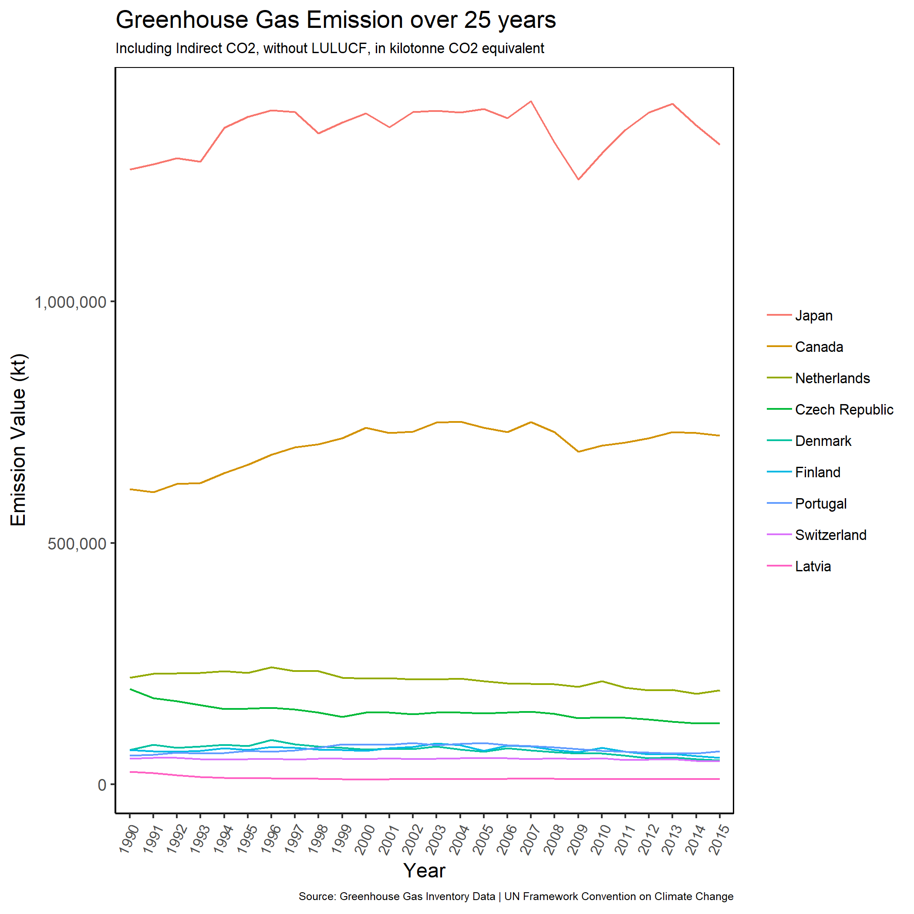
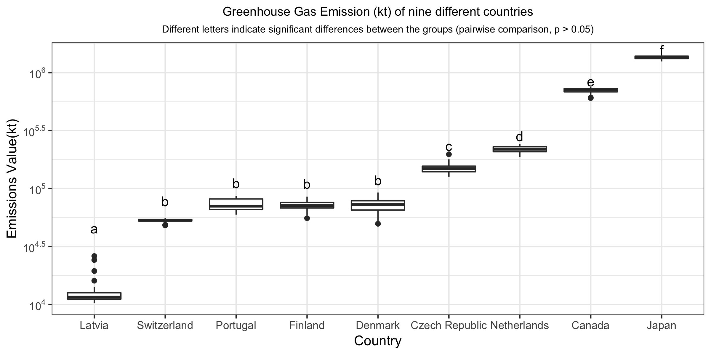

This report contains an inferential analysis regarding the Greenhouse Gas Emissions from 10 countries or regions between 1990 and 2015. The analysis aims to find if there is a difference of greenhouse gas emissions (kt) across these countries in the past 25 years. An ANOVA was performed to determine whether there is any significant difference in GHG Emissions when observed, multiple comparisons on counties were performed. The [data]("http://data.un.org/Data.aspx?d=GHG&f=seriesID%3aGH2") is obtained from the Greenhouse Gas Inventory Data of the United Nations Framework Convention on Climate Change. 
  

#### Our hypotheses are as follows:

 *H*0: There is no difference between the amount of Greenhouse Gas Emissions between the 10 nations from 1990 to 2015.
 
 *H**A*: There is a difference between the amount of Greenhouse Gas Emissions between the 10 nations from 1990 to 2015.

#### Analysis of National Emissions 

25 years of collected data shows emissions for each of the nine nations, these figures seem to display different patterns, with a group of nations having very similar emission volumes (Figure 1). The aim of this analysis is to find out whether there is a significant difference in greenhouse gas emissions among all the nations. Prior to the analysis, we performed exploratory data analysis (Zuur et al., 2010). Greenhouse gas emission and countries were analyzed by a one-way ANOVA, the significance level was set at *p* &lt; 0.05, and pairwise comparisons between the multiple nations' were evaluated.

{width=350px}  

Figure 1: Initial Exploratory analysis of the data shows there looks to be a difference in emissions for some nations, but not all.   

After running the initial exploratory analysis, it shows the European Union has significantly higher values. Because we are unable to see which countries were aggregated in the European Union category and their individual values, we decided to remove the aggregate group titled "European Union" and kept the individually labeled nations.

#### Statistical Summary of ANOVA:  

Table 1: ANOVA test output  

| term | df | sumsq | meansq | statistic | p.value |
|-----------|-----|-------------|-------------|-------------|-----------|
| Country | 9 | 5.73925E+14 | 6.37695E+13 | 4536.75 | <.001 |
| Residuals | 250 |3.51405E+12 | 1.406E+10 |         |        |

The one-way ANOVA indicates that the greenhouse emission of the nine nations are significantly different from each other (p-value < 0.05). Additionally, pairwise comparisons were conducted to determine which nations are significantly different from each other. 

{width=400px}

Figure 2: Greenhouse Gas Emission (kt) of nine different countries in the past 25 years. Different letters indicate significant differences between the groups (pairwise comparison, *p* &lt; 0.05).

#### Interpretation of Findings:  

Latvia demonstrated the least GHG emissions of all the countries, as research shows their government had established policies regarding renewable energy that resulted in 29.6 % of energy consumptions in 2009 to be renewable (Roos et al., 2012). Canada and Japan displayed significantly higher emission in the past 25 years. It is noted that Canada's greenhouse gas emission is originating from farming-related activities and oil production which requires a large amount of fossil-energy (Jarzen et al., 1998). Japan's high emission is due to the nation's reliance on natural gas and coal to generate electricity (Itawa, 2017).

### Critics, limitations, and assumptions on analysis: 

1. European Union data was removed as countries are not identified in the data and were aggregated, skewing the data presented.
2. If compositions of the EU nations included in this data source, we would be able to split the EU emission into countries or further apply normalization to smooth out differences.
3. In future analysis, we should try our best to keep all the original data in our analysis. We could do some sort of transformation to scale data to be on the same plane.
4. Future analysis can shed light on GHG Emission over the years and which countries are statistically improving or not improving on the reduction of GHG Emission using time-series analysis. 

## References

  "Greenhouse Gas (GHGs) Emissions, including Indirect CO2, without LULUCF, in kilotonne CO2 equivalent" Greenhouse Gas Inventory Data, United Nations Framework Convention on Climate Change, website: http://data.un.org/Data.aspx?d=GHG&f=seriesID%3aGH2  

  David Robinson, Alex Hayes, Matthieu Gomez, Boris Demeshev, Dieter Menne, Benjamin Nutter, Luke Johnston, Ben Bolker, Francois Briatte, Jeffrey Arnold, Jonah Gabry, Luciano Selzer, Gavin Simpson, Jens Preussner, Jay Hesselberth, Hadley Wickham, Matthew Lincoln, Alessandro Gasparini, Lukasz Komsta, Frederick Novometsky, Wilson Freitas, Michelle Evans, Jason Cory Brunson, Simon Jackson, Ben Whalley, Michael Kuehn, Jorge Cimentada, Erle Holgersen, Karl Dunkle Werner (2018).broom: Summarizes key information about statistical objects in tidy tibbles. This makes it easy to report results, create plots and consistently work with large numbers of models at once. R package version 0.5.0  https://cran.r-project.org/web/packages/broom/index.html  

  Hadley Wickham (2017). tidyverse: Easily Install and Load the 'Tidyverse'. R package version 1.2.1. https://CRAN.R-project.org/package=tidyverse  

  Hadley Wickham (2018). forcats: Helpers for reordering factor levels (including moving specified levels to front, ordering by first appearance, reversing, and randomly shuffling), and tools for modifying factor levels (including collapsing rare levels into other, 'anonymising', and manually 'recoding'). R package version 0.3.0 https://cran.r-project.org/packages=forcats  

  Hadley Wickham, Jim Hester, Romain Francois, Jukka Jylänki, Mikkel Jørgensen (2017). readr: The goal of 'readr' is to provide a fast and friendly way to read rectangular data (like 'csv', 'tsv', and 'fwf'). It is designed to flexibly parse many types of data found in the wild, while still cleanly failing when data unexpectedly changes. R package version 1.1.1
  https://cran.r-project.org/web/packages/readr/  

  Hadley Wickham, Romain François, Lionel Henry, Kirill Müller(2018).dplyr: A fast, consistent tool for working with data frame like objects, both in memory and out of memory. R package version 0.7.6. https://cran.r-project.org/web/packages/dplyr/  

  Hadley Wickham, Winston Chang, Lionel Henry, Thomas Lin Pedersen, Kohske Takahashi, Claus Wilke, Kara Woo (2018). ggplot2: A system for 'declaratively' creating graphics, based on "The Grammar of Graphics". You provide the data, tell 'ggplot2' how to map variables to aesthetics, what graphical primitives to use, and it takes care of the details.R package version 3.0.0. https://cran.r-project.org/web/packages/ggplot2/  

  Hadley Wickham (2018) scales: Graphical scales map data to aesthetics, and provide methods for automatically determining breaks and labels for axes and legends.R package version 1.0.0. https://cran.r-project.org/web/packages/scales/  

  Itawa, Mari (2017). The Wall Streeet Journal. "Japan CO2 Emissions Worst on Record". https://blogs.wsj.com/japanrealtime/2014/11/17/japan-co2-emissions-worst-on-record/.
  

  Janzen, H.H., 1999. Health of our air: Toward sustainable agriculture in Canada (No. MIC-99-04464/XAB; SSC-A-53-1981/1998E). Agriculture and Agri-Food Canada, Research Branch, Ottawa, Ontario (Canada).  

  Roos, I., Soosaar, S., Volkova, A. and Streimikene, D., 2012. Greenhouse gas emission reduction perspectives in the Baltic States in frames of EU energy and climate policy. Renewable and Sustainable Energy Reviews, 16(4), pp.2133-2146.  
  
  Zuur, A.F., Ieno, E.N. and Elphick, C.S., 2010. A protocol for data exploration to avoid common statistical problems. Methods in ecology and evolution, 1(1), pp.3-14.

