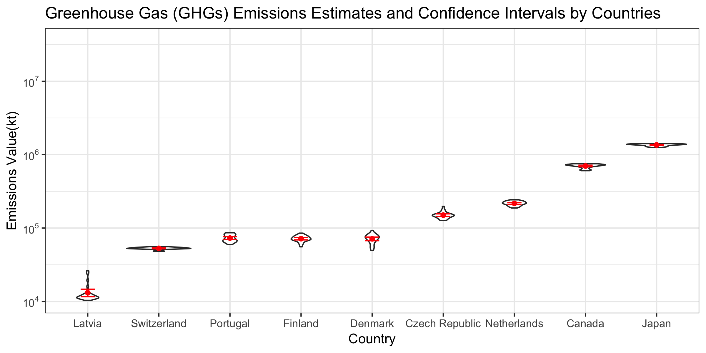

This report contains an inferential analysis regarding the Greenhouse Gas Emissions from 10 countries between 1990 and 2015. The main analysis aims to find these is a differences of greenhouse gas emissions (kt) across the countries in the past 25 years. ANOVA was performed to determine whether there is any significant difference in greenhouse gas emission among 10 countries, when observed, multiple comperisons on counties were performed. The [data]("http://data.un.org/Data.aspx?d=GHG&f=seriesID%3aGH2") is obtained from the Greenhouse Gas Inventory Data of the United Nations Framework Convention on Climate Change. 

The 25 years of data shows emissions for each of the nine nations have displayed different patterns, with a majority of nations having very similar emission volumes (Figure 1) The aim of the projest is to find out whether there is a significant difference in greenhouse gas emissions among nations. Greenhouse gas emission and countries were analyzed by one-way ANOVA, significance level was set at P < 0.05 and pairwise comparisons between the multiple nation's were evaluated.

Our hypothesis are as follows:

\textbf{$H_{0}$}: There is no difference between the amount of Greenhouse Gas Emissions between the 10 nations from 1990 to 2015.  
\textbf{$H_{A}$}: There is a difference between the amount of Greenhouse Gas Emissions between the 10 nations from 1990 to 2015.

#the statistical summaries, and/or the figures in a little report. 

Kera comment: inbed ANOVA table here.
 
#presents the findings/results, and 

- One-way ANOVA indicates that the greenhouse emission of the nine nations are significantly different than each other (p-value < 0.05). Additionally pairwise comparisons were conducted to determine which countries are significantly different from each other (Figure 2? boxplot with the letters) 

#interprets the findings/results in context of the question. 
- Latvia demontrated the least greenhouse gas emmision of all the countries that were included to the analysis, the goverment of Latvia established policies regarding renewable energy in which was the mair energy consumption by 29.6 % of all energy consumptions in 2009 (Roos et al., 2012). Canada and Japan displayed significantly high greenhouse gas emmission in the past 25 years compared to other counties. Jarzen et al. (1998) discussed that 10% of Canada's greenhouse emmision is originated farming-related activities such as farming operations which requires fossil-energy. WHY JAPAN IS HIGH, discuss

#Some critique of the analysis is also expected (limitations, assumptions, etc) and 
#a statement of future directions (what would you do next if you had more time to work on this). 

- European Union data was removed as countries are not identified in the resource and additionally their greenhouse gas emission value was higher that the rest of the countries (Figure 3).
- If we know the compositions of the EU countries included in this data source, we would be able to split the EU emission into countries and include EU countries into our analysis.
- In future analysis we should try our best to keep all the original data in our analysis. We could do some sort of transformation to make sense of all data.
- Future analysis can shed light on greenhouse gas emmision over the years and which countries are statistacally improving reduction in greenhouse gas emmision using time-series analysis. 

#The report is expected to be 1-2 written pages (excluding figures, tables and references). You are #expected to have a reference section and cite 2-3 external sources (data source can be one of #these citations).

## Appendix

  
{width=400px}
Figure 1: Explanotary data analysis indicates that the Europian Union had the highest greengouse gas emmision and this category was discarded from the analysis to avoid skewness.

 Figure 2: Greenhouse gas emmision (kt) of nine differnet countries in the past 25 years. Different letters indicate significant differences between the groups (pairwise comparison, p < 0.05).

#### Figure 3: KERA: this figure doesn't add much to the story, it can be discarded.

## References

"Greenhouse Gas (GHGs) Emissions, including Indirect CO2, without LULUCF, in kilotonne CO2 equivalent" Greenhouse Gas Inventory Data, United Nations Framework Convention on Climate Change, website: http://data.un.org/Data.aspx?d=GHG&f=seriesID%3aGH2

<<<<<<< HEAD
> citation("tidyverse")

  Hadley Wickham (2017). tidyverse: Easily Install and Load the 'Tidyverse'. R package version 1.2.1.
  https://CRAN.R-project.org/package=tidyverse
  
> citation("forcats")

  Hadley Wickham (2018). forcats: Helpers for reordering factor levels (including moving specified levels to front, ordering by first appearance, reversing, and randomly shuffling), and tools for modifying factor levels (including collapsing rare levels into other, 'anonymising', and manually 'recoding'). R package version 0.3.0
  https://cran.r-project.org/packages=forcats

> citation("readr")

  Hadley Wickham, Jim Hester, Romain Francois, Jukka Jylänki, Mikkel Jørgensen (2017). readr: The goal of 'readr' is to provide a fast and friendly way to read rectangular data (like 'csv', 'tsv', and 'fwf'). It is designed to flexibly parse many types of data found in the wild, while still cleanly failing when data unexpectedly changes. R package version 1.1.1
  https://cran.r-project.org/web/packages/readr/

> citation("dplyr")

  Hadley Wickham, Romain François, Lionel Henry, Kirill Müller(2018).dplyr: A fast, consistent tool for working with data frame like objects, both in memory and out of memory. R package version 0.7.6
  https://cran.r-project.org/web/packages/dplyr/

> citation("ggplot2")

  Hadley Wickham, Winston Chang, Lionel Henry, Thomas Lin Pedersen, Kohske Takahashi, Claus Wilke, Kara Woo (2018). ggplot2: A system for 'declaratively' creating graphics, based on "The Grammar of Graphics". You provide the data, tell 'ggplot2' how to map variables to aesthetics, what graphical primitives to use, and it takes care of the details.R package version 3.0.0
  https://cran.r-project.org/web/packages/ggplot2/

> citation("broom")

  David Robinson, Alex Hayes, Matthieu Gomez, Boris Demeshev, Dieter Menne, Benjamin Nutter, Luke Johnston, Ben Bolker, Francois Briatte, Jeffrey Arnold, Jonah Gabry, Luciano Selzer, Gavin Simpson, Jens Preussner, Jay Hesselberth, Hadley Wickham, Matthew Lincoln, Alessandro Gasparini, Lukasz Komsta, Frederick Novometsky, Wilson Freitas, Michelle Evans, Jason Cory Brunson, Simon Jackson, Ben Whalley, Michael Kuehn, Jorge Cimentada, Erle Holgersen, Karl Dunkle Werner (2018).broom: Summarizes key information about statistical objects in tidy tibbles. This makes it easy to report results, create plots and consistently work with large numbers of models at once. R package version 0.5.0
  https://cran.r-project.org/web/packages/broom/index.html
   	
> citation("scales")

  Hadley Wickham (2018) scales: Graphical scales map data to aesthetics, and provide methods for automatically determining breaks and labels for axes and legends.R package version 1.0.0
  https://cran.r-project.org/web/packages/scales/
=======
Janzen, H.H., 1999. Health of our air: Toward sustainable agriculture in Canada (No. MIC-99-04464/XAB; SSC-A-53-1981/1998E). Agriculture and Agri-Food Canada, Research Branch, Ottawa, Ontario (Canada).

Roos, I., Soosaar, S., Volkova, A. and Streimikene, D., 2012. Greenhouse gas emission reduction perspectives in the Baltic States in frames of EU energy and climate policy. Renewable and Sustainable Energy Reviews, 16(4), pp.2133-2146.
>>>>>>> upstream/master

